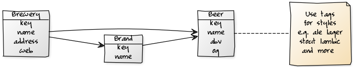

_Cheers, Prost, Kampai, Na zdravi, Salute, 乾杯, Skål, Egészségedre!_


github: [beerkit/beer.db](https://github.com/beerkit/beer.db),
rubygems: [beerdb](https://rubygems.org/gems/beerdb),
rdoc: [beerdb](http://rubydoc.info/gems/beerdb)  ++
more: [comments on reddit, please!](https://www.reddit.com/r/ruby/comments/7lrrdk/day_23_ruby_advent_calendar_2017_beerdb_serve/)


## What's the beerdb library?

The beerdb library offers a ready-to-use database schema (in SQL)
and models such as - surprise, surprise -
`Beer`, `Brewery`, `Brand`
and friends (using the `ActiveRecord` object-relational mapper machinery). Example:




Let's try the brewery model:

``` ruby
by = Brewery.find_by( key: 'guinness' )

by.title
#=> 'St. James's Gate Brewery / Guinness Brewery'

by.country.key
#=> 'ie'

by.country.title
#=> 'Ireland'

by.city.title
#=> 'Dublin'

by.beers.first
#=> 'Guinness', 4.2

...
```

Or let's try the beer model:


``` ruby
b = Beer.find_by( key: 'guinness' )

b.title
#=> 'Guinness'

b.abv    # that is, alcohol by volume (abv)
#=> 4.2

b.tags
#=> 'irish_dry_stout', 'dry_stout', 'stout'

b.brewery.title
#=> 'St. James's Gate Brewery / Guinness Brewery'
...
```

What's it good for? Good question. Let's build an HTTP JSON service
that serves up a Guinness Irish Stout
or a Bamberg Aecht Schlenkerla Rauchbier Märzen as JSON?
Example - `GET /beer/guinness`:

``` json
{
  "key": "guinness",
  "title": "Guinness",
  "synonyms": "Guinness Draught",
  "abv": "4.2",
  "srm": null,
  "og": null,
  "tags": ["irish_dry_stout","dry_stout","stout"],
  "brewery":
  {
    "key": "guinness",
    "title": "St. James's Gate Brewery / Guinness Brewery"
  },
  "country":
  {
    "key": "ie",
    "title": "Irland"
  }
}
```

Let's use the Sinatra-like webservice library that offers a mini language,
that is, domain-specific language (DSL)
that lets you define routes, that is, HTTP methods paired with an URL-matching pattern
and much more.
For example, you can code the `GET /beer/guinness` route in
the webservice library as `get '/beer/guinness'`.
To make it into a route for any beer lets replace the `guinness` beer key
with a placeholder, thus, resulting in `get '/beer/:key'`. Let's run it:

`service.rb`:

``` ruby

class BeerService < Webservice::Base

  include BeerDb::Models     # lets (re)use the Beer, Brewery, etc. models

  get '/beer/:key' do
    Beer.find_by!( key: params[:key] )
  end

end
```

That's it. Ready to serve. Let's boot-up the beer service
with a web server (e.g. Thin) using a Rack handler. Example:

`boot.rb`:

``` ruby
require 'webservice'      # note: webservice will pull in web server machinery (e.g. rack, thin, etc.)
require 'beerdb/models'   # note: beerdb will pull in database access machinery (e.g. activerecord, etc.)

# database setup 'n' config
ActiveRecord::Base.establish_connection( adapter:  'sqlite3', database: './beer.db' )


require './service'

Rack::Handler::Thin.run BeerService, :Port => 9292
```

Try:

```
$ ruby ./boot.rb
```

Open up your browser and try `http://localhost:9292/beer/guinness`.
Voila. Enjoy your Guinness irish stout responsibly.


## Bonus: Let's add brewery details and more

Let's add brewery details to the beer service and lets add a new `GET /brewery` route. Example:

``` ruby
get '/beer/:key' do
  beer = Beer.find_by!( key: params[ :key ] )

  brewery = {}
  if beer.brewery.present?
     brewery = { key:   beer.brewery.key,
                 title: beer.brewery.title }
  end

  tags = []
  if beer.tags.present?
     beer.tags.each { |tag| tags << tag.key }
  end

  { key:      beer.key,
    title:    beer.title,
    synonyms: beer.synonyms,
    abv:      beer.abv,
    srm:      beer.srm,
    og:       beer.og,
    tags:     tags,
    brewery:  brewery,
    country:  { key:   beer.country.key,
                title: beer.country.title }
  }
end


get '/brewery/:key' do

  brewery = Brewery.find_by!( key: params[:key] )

  beers = []
  brewery.beers.each do |b|
    beers << { key: b.key, title: b.title }
  end

  tags = []
  if brewery.tags.present?
     brewery.tags.each { |tag| tags << tag.key }
  end

  { key:      brewery.key,
    title:    brewery.title,
    synonyms: brewery.synonyms,
    since:    brewery.since,
    address:  brewery.address,
    web:      brewery.web,
    tags:     tags,
    beers:    beers,
    country:  { key:   brewery.country.key,
                title: brewery.country.title }
  }
end
```


## beer.db HTTP JSON API (web service) scripts


beer.db HTTP JSON API (web service) scripts

### Usage

You can run any of the scripts using the `beerdb` command line tool. By default the `serve` command will look for
a script named `Service` or `service.rb` (in the working folder, that is, `./`). Example:

```
$ beerdb serve
```

To run any other script - copy the script into the working folder and pass it along as an argument. Example:

```
$ beerdb serve starter      #  note: will (auto-)add the .rb extension  or
$ beerdb serve starter.rb
```


#### starter.rb - Starter beer.db HTTP JSON API

``` ruby
get '/beer/(r|rnd|rand|random)' do     ## special keys for random beer
  Beer.rnd
end

get '/beer/:key' do
  Beer.find_by! key: params['key']
end


get '/brewery/(r|rnd|rand|random)' do    ## special keys for random brewery
  Brewery.rnd
end

get '/brewery/:key' do
  Brewery.find_by! key: params['key']
end
```

(Source: [beer.db.service/starter.rb](https://github.com/beerkit/beer.db.service/blob/master/starter.rb))


#### service.rb - Service beer.db HTTP JSON API

``` ruby
get '/' do

  ## self-docu in json
  data = {
    endpoints: {
      get_beer: {
        doc: 'get beer by key',
        url: '/beer/:key'
      },
    }
  }

end


get '/notes/:key' do |key|

  puts "  handle GET /notes/:key"

  if ['l', 'latest'].include?( key )
     # get latest tasting notes (w/ ratings)
    notes = Note.order( 'updated_at DESC' ).limit(10).all
  elsif ['h', 'hot'].include?( key )
     # get latest tasting notes (w/ ratings)
     # fix: use log algo for "hotness" - for now same as latest
    notes = Note.order( 'updated_at DESC' ).limit(10).all
  elsif ['t', 'top'].include?( key )
    notes = Note.order( 'rating DESC, updated_at DESC' ).limit(10).all
  else
    ### todo: move to /u/:key/notes ??

    # assume it's a user key
    user = User.find_by_key!( key )
    notes = Note.order( 'rating DESC, updated_at DESC' ).where( user_id: user.id ).all
  end

  data = []
  notes.each do |note|
    data << {
       beer: { title:  note.beer.title,
               key:    note.beer.key },
       user: { name:   note.user.name,
               key:    note.user.key },
       rating:      note.rating,
       comments:    note.comments,
       place:       note.place,
       created_at:  note.created_at,
       updated_at:  note.updated_at
    }
  end

  data
end


get '/notes' do
  if params[:method] == 'post'

    puts "  handle GET /notes?method=post"

    user = User.find_by_key!( params[:user] )
    beer = Beer.find_by_key!( params[:beer] )
    rating = params[:rating].to_i
    place  = params[:place]   # assumes for now a string or nil / pass through as is

    attribs = {
      user_id: user.id,
      beer_id: beer.id,
      rating:  rating,
      place:   place
    }

    note = Note.new
    note.update_attributes!( attribs )
  end

  { status: 'ok' }
end


get '/drinks/:key' do |key|

  puts "  handle GET /drinks/:key"

  if ['l', 'latest'].include?( key )
     # get latest +1 drinks
     ## todo: order by drunk_at??
    drinks = Drink.order( 'updated_at DESC' ).limit(10).all
  else
    ### todo: move to /u/:key/drinks ??

    # assume it's a user key
    user = User.find_by_key!( key )
    drinks = Drink.order( 'updated_at DESC' ).where( user_id: user.id ).all
  end

  data = []
  drinks.each do |drink|
    data << {
       beer: { title:  drink.beer.title,
               key:    drink.beer.key },
       user: { name:   drink.user.name,
               key:    drink.user.key },
       place:       drink.place,
       drunk_at:    drink.drunk_at,
       created_at:  drink.created_at,
       updated_at:  drink.updated_at
    }
  end

  data
end


get '/drinks' do
  if params[:method] == 'post'

    puts "  handle GET /drinks?method=post"

    user = User.find_by_key!( params[:user] )
    beer = Beer.find_by_key!( params[:beer] )
    place  = params[:place]   # assumes for now a string or nil / pass through as is

    attribs = {
      user_id: user.id,
      beer_id: beer.id,
      place:   place
    }

    drink = Drink.new
    drink.update_attributes!( attribs )
  end

  { status: 'ok' }
end


get '/beer/:key' do |key|

  if ['r', 'rnd', 'rand', 'random'].include?( key )
    # special key for random beer
    # Note: use .first (otherwise will get ActiveRelation not Model)
    beer = Beer.rnd.first
  else
    beer = Beer.find_by_key!( key )
  end
end


get '/brewery/:key' do |key|

  if ['r', 'rnd', 'rand', 'random'].include?( key )
    # special key for random brewery
    # Note: use .first (otherwise will get ActiveRelation not Model)
    brewery = Brewery.rnd.first
  else
    brewery = Brewery.find_by_key!( key )
  end
end
```

(Source: [beer.db.service/service.rb](https://github.com/beerkit/beer.db.service/blob/master/service.rb))
