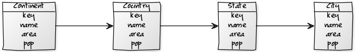
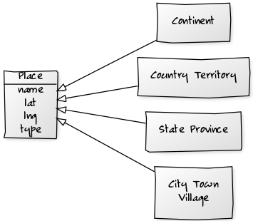

## Usage Models

Class Model Diagrams



Everything is a place.




`Country` Model - Example:

``` ruby
at = Country.find_by! key: 'at'
at.name
# => 'Austria'
at.pop
# => 8_414_638
at.area
# => 83_871

at.states.count
# => 9
at.states
# => [ 'Wien', 'Niederösterreich', 'Oberösterreich', ... ]

at.cities.by_pop
# => [ 'Wien', 'Graz', 'Linz', 'Salzburg', 'Innsbruck' ... ]
```

`City` Model - Example:

``` ruby
c = City.find_by! key: 'wien'
c.name
# => 'Wien'
c.country.name
# => 'Austria'
c.country.continent.name
# => 'Europe'

la = City.find_by! key: 'losangeles'
la.name
# => 'Los Angeles'
la.state.name
# => 'California'
la.state.key
# => 'ca'
la.country.name
# => 'United States'
la.country.key
# => 'us'
la.country.continent.name
# => 'North America'
```

`Tag` Model - Example:

``` ruby
euro = Tag.find_by! key: 'euro'
euro.countries.count
# => 17
euro.countries
# => ['Austria, 'Belgium', 'Cyprus', ... ]

flanders = Tag.find_by! key: 'flanders'
flanders.states.count
# => 5
flanders.states
# => ['Antwerpen', 'Brabant Wallon', 'Limburg', 'Oost-Vlaanderen', 'West-Vlaanderen']
flanders.states.first.country.name
# => 'Belgium'
```

and so on.


##  world.db Web Service (HTTP JSON API) Starter Sample

The [worlddb web service starter sample](https://github.com/worlddb/world.db.starter) lets you build your own HTTP JSON API
using the
[`world.db`](https://github.com/openmundi).  Example:

```ruby
class StarterApp < Webservice::Base

  #####################
  # Models

  include WorldDb::Models   # e.g. Continent, Country, State, City, etc.


  ##############################################
  # Controllers / Routing / Request Handlers

  get '/countries(.:format)?' do
    Country.by_key.all    # sort/order by key
  end

  get '/cities(.:format)?' do
    City.by_key.all       # sort/order by key
  end

  get '/tag/:slug(.:format)?' do   # e.g. /tag/north_america.csv
    Tag.find_by!( slug: params['slug'] ).countries
  end

  ...
end # class StarterApp
```

(Source: [`app.rb`](app.rb))


## Getting Started

Step 1: Install all libraries (Ruby gems) using bundler. Type:

    $ bundle install

Step 2: Copy an SQLite database e.g. `world.db` into your folder.

Step 3: Startup the web service (HTTP JSON API). Type:

    $ ruby ./server.rb

That's it. Open your web browser and try some services
running on your machine on port 9292 (e.g. `localhost:9292`). Example:


List all the world countries (in JSON - the default format):

- `http://localhost:9292/countries`

List all the world countries (in CSV):

- `http://localhost:9292/countries.csv`

List all the world countries (in HTML w/ simple table):

- `http://localhost:9292/countries.html`

List all cities (in JSON):

- `http://localhost:9292/cities`

List all cities (in CSV):

- `http://localhost:9292/cities.csv`

List all countries tagged with `north_america` (in JSON):

- `http://localhost:9292/tag/north_america`

List all countries tagged with `north_america` (in CSV):

- `http://localhost:9292/tag/north_america.csv`


And so on. Now change the [`app.rb`](app.rb) script to fit your needs. Be bold. Enjoy.


## world.db HTTP JSON API (web service) scripts

world.db HTTP JSON API (web service) scripts

### Usage

You can run any of the scripts using the `worlddb` command line tool. By default the `serve` command will look for
a script named `Service` or `service.rb` (in the working folder, that is, `./`). Example:

```
$ worlddb serve
```

To run any other script - copy the script into the working folder and pass it along as an argument. Example:

```
$ worlddb serve starter      #  note: will (auto-)add the .rb extension  or
$ worlddb serve starter.rb
```


#### starter.rb - Starter world.db HTTP JSON API

``` ruby
get '/countries(.:format)?' do
  Country.by_key.all    # sort/order by key
end

get '/cities(.:format)?' do
  City.by_key.all       # sort/order by key
end

get '/tag/:slug(.:format)?' do   # e.g. /tag/north_america.csv
  Tag.find_by!( slug: params['slug'] ).countries
end
```

(Source: [world.db.service/starter.rb](https://github.com/worlddb/world.db.service/blob/master/starter.rb))


#### service.rb - Service world.db HTTP JSON API


``` ruby

get '/countries(.:format)?' do
  Country.by_key.all    # sort/order by key
end

get '/cities(.:format)?' do
  City.by_key.all       # sort/order by key
end

get '/continents(.:format)?' do
  Continent.all
end


get '/tag/:slug(.:format)?' do      # e.g. /tag/north_america.csv
  Tag.find_by!( slug: params['slug'] ).countries
end

```

(Source: [world.db.service/service.rb](https://github.com/worlddb/world.db.service/blob/master/service.rb))
